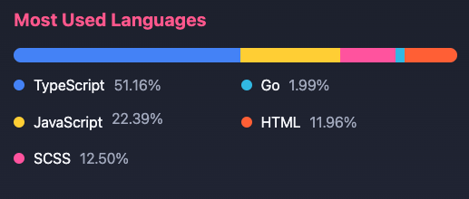

 

  

###

<h1 align="center">Hi 👋, I'm Flambel SANOU</h1>

###

  
  
  
  
  
  

###
###

  
  

###
###
<h3 align="justify">I am Flambel SANOU, a versatile professional with expertise in software development, UI/UX design, and the integration of cutting-edge technological solutions. I'm specialise in delivering high-quality learning management systems, web and mobile applications. With a strong background in project management, technical mentoring, and I am an academic instructor at the University of the Mountains in West Cameroon. I have successfully collaborated with diverse teams to create intuitive and user-centric digital experiences. My passion lies in leveraging innovation to drive impactful solutions for clients and communities.</h3>

  

  

  

- 🔭 I’m currently working on [Yabi Events](https://yabi.cm)

- 🌱 I’m currently learning **Google Cloud Architect**

- 👨‍💻 All of my projects are available at [https://flambel-sanou.yaba-in.com](https://flambel-sanou.yaba-in.com)

- 📝 I regularly write articles on [https://cm.linkedin.com/in/flambel-junior-sanou-ku%C3%A9-852703175](https://cm.linkedin.com/in/flambel-junior-sanou-ku%C3%A9-852703175)

- 💬 Ask me about **Angular, Ionic, Firebase and UI/UX Design**

- 📫 To reach me, use **contact@yaba-in.com**

<h3 align="left">Connect with me:</h3>

###
